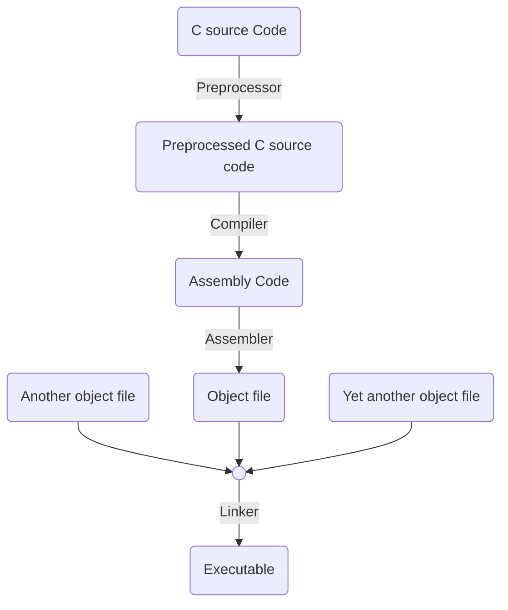
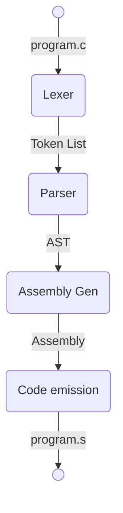

# My First `C` Compiler
## Material
**Writing a C Compiler(Build a real programming language from scratch)** - Nora Sandler
We will do this in _Rust_

## Part 0 : A High-Level Overview
`Compiler` : Program that translates code from one programming language to another

`Assembler` : Program that translates assembly into `object files`

`Linker` : Combines all object files to make one final `executable` program.

`Preprocessor` : Does preprocess before the compile occurs : Strip comments, execute directives, expand macros, etc.

We are not going to implement the preprocessor, assembler, and the linker.

## Part 1 : The Basics
### Design Workflow
