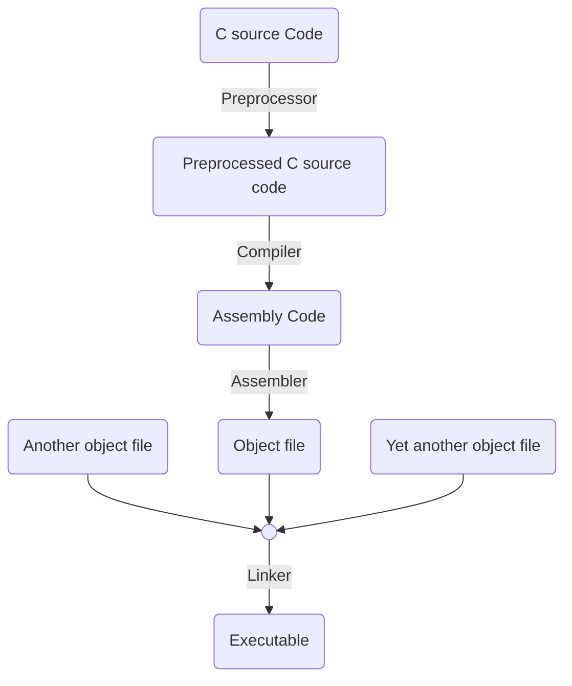
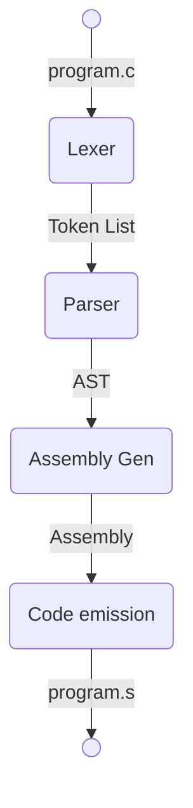

# My First `C` Compiler
## Material
**Writing a C Compiler(Build a real programming language from scratch)** - Nora Sandler
We will do this in <span style="color:#B94700">_Rust_</span>

## Usage
### Basic Usage
```bash
# Compile to assembly (creates input.s)
cargo run -- input.c

# Specify output file
cargo run -- input.c -o output.s
cargo run -- input.c --output output.s
```

### Different Compilation Stages
```bash
# Stop after lexing (print tokens)
cargo run input.c --lex-only

# Stop after parsing (print AST)
cargo run input.c --parse-only

# Stop after IR generation (print intermediate representation)
cargo run input.c --ir-only
```


## Part 0 : A High-Level Overview
`Compiler` : Program that translates code from one programming language to another

`Assembler` : Program that translates assembly into `object files`

`Linker` : Combines all object files to make one final `executable` program.

`Preprocessor` : Does preprocess before the compile occurs : Strip comments, execute directives, expand macros, etc.


We are not going to implement the preprocessor, assembler, and the linker.

## Part 1 : The Basics
### Design Workflow


### Lexer
The lexer reads the source file and produces a list of tokens. 


* `Identifier` : [a-zA-Z_]\w+\\b
* (integer)`Constant` : [0-9]+\\b